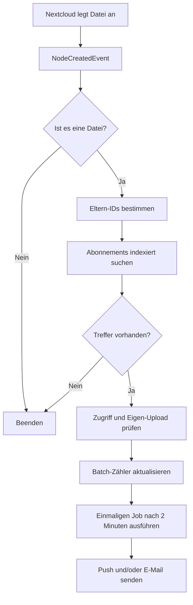

# Projektauftrag: Folder Upload Notifications for Nextcloud

| Feld | Inhalt |
|---|---|
| Dokumentstatus | Entwurf zur Projektfreigabe |
| Version | 0.1 |
| Stand | 07.08.2026 |
| Auftraggeber / Product Owner | AlexPuchner |
| Projektart | Open-Source-App für Nextcloud |
| Repository | `AlexPuchner/nextcloud-folder-upload-notifications` |
| vorgesehene App-ID | `folder_upload_notifications` |
| vorgesehene Lizenz | AGPL-3.0-or-later |

## 1. Ausgangslage

Nextcloud kann Aktivitäten und allgemeine Dateiänderungen melden, bietet Benutzern aber keine einfache, zuverlässige Möglichkeit, einen konkreten Ordner zu abonnieren und ausschließlich bei neuen Dateien in diesem Ordner benachrichtigt zu werden. Bestehende Flow-Lösungen benötigen Hilfskonstruktionen mit Tags, lassen sich nicht sauber auf den Ordnerpfad begrenzen oder reagieren zum falschen Zeitpunkt. Die veraltete App `file_upload_notification` ist keine geeignete technische Grundlage: Sie verwendet alte Hooks, besitzt keine moderne Ordnerauswahl und arbeitet nicht mit dem aktuellen Nextcloud-Benachrichtigungssystem.

Deshalb wird eine neue App entwickelt, die moderne Nextcloud-OCP-Schnittstellen verwendet und bewusst klein, wartbar und ressourcenschonend bleibt.

## 2. Projektziel

Benutzer sollen einen Ordner in Nextcloud abonnieren können. Wird dort eine neue Datei angelegt, erhalten alle berechtigten Abonnenten eine native Nextcloud-Benachrichtigung mit Dateiname, Ordner, optionalem Urheber und einem direkten Link zur Datei. Mehrere Dateien desselben Uploaders im selben Zielordner werden innerhalb von zwei Minuten zu einer Sammelmeldung zusammengefasst.

Die Verarbeitung muss vollständig ereignisgesteuert erfolgen. Ohne Dateiänderung verursacht die App keine wiederkehrende Arbeit. Es gibt insbesondere keine Ordner-Scans, keine Polling-Schleife und keinen dauerhaft laufenden Zusatzprozess.

## 3. Produktvision

> „Ordner abonnieren, neue Datei sehen, einmal tippen und direkt öffnen – ohne Konfigurationsbastelei und ohne messbare Last im Leerlauf.“

Die App soll sich wie eine native Nextcloud-Funktion anfühlen. Die Bedienung erfolgt direkt in der Dateien-App und in einer übersichtlichen persönlichen Einstellungsseite.

## 4. Stakeholder und Benutzergruppen

| Rolle | Interesse |
|---|---|
| Nextcloud-Benutzer | Bestimmte Ordner abonnieren und relevante Uploads zeitnah sehen |
| Ordner-/Share-Eigentümer | Dateien bereitstellen, ohne Empfänger separat informieren zu müssen |
| Nextcloud-Administrator | Sichere, wartbare App ohne Hintergrundlast betreiben |
| Projektmaintainer | Klare Architektur, automatisierte Tests und geringe API-Abhängigkeit |

## 5. Projektumfang

### 5.1 MVP – verpflichtender Funktionsumfang

1. Benutzer können auf einen für sie zugänglichen Ordner ein Abonnement setzen.
2. Benutzer können ein Abonnement wieder entfernen.
3. Neue Dateien werden über `OCP\Files\Events\Node\NodeCreatedEvent` erkannt.
4. Ordnerereignisse lösen keine Upload-Benachrichtigung aus.
5. Ein Abonnement kann nur den Ordner selbst oder rekursiv auch Unterordner umfassen.
6. Eigene Uploads werden standardmäßig nicht gemeldet; das Verhalten ist je Abonnement umstellbar.
7. Benachrichtigungen erscheinen in der Nextcloud-Glocke und werden über bereits konfigurierte Nextcloud-Push-Kanäle weitergereicht.
8. Die Benachrichtigung enthält mindestens Dateiname und abonnierten Ordner.
9. Die Benachrichtigung enthält nach Möglichkeit den hochladenden Benutzer.
10. Ein Link öffnet die betroffene Datei beziehungsweise ihren Ordner in der Dateien-App.
11. Abonnements bleiben bei einer Umbenennung oder Verschiebung des abonnierten Ordners erhalten.
12. Eine persönliche Einstellungsseite listet und verwaltet alle eigenen Abonnements.
13. Eigene und mit dem Benutzer geteilte Ordner werden unterstützt.
14. Vor dem Benachrichtigen wird geprüft, ob der Empfänger noch Zugriff auf den abonnierten Ordner besitzt.
15. Benutzeroberfläche und Benachrichtigungstexte stehen mindestens auf Deutsch und Englisch zur Verfügung.
16. Push und E-Mail sind pro Abonnement getrennt wählbar.
17. Massen-Uploads erzeugen pro Empfänger, Uploader und Zielordner höchstens eine Meldung je zweiminütigem Sammelfenster.

### 5.2 Erweiterungen nach dem MVP

- optionales Melden von Dateien, die in den Ordner verschoben werden
- optionales Melden von Dateien, die in den Ordner kopiert werden
- optionale Filter nach Dateityp, Dateiendung, Größe oder Uploader
- administratorweite Standardwerte und Funktionsfreigaben
- Export und Import persönlicher Abonnements
- App-Store-Veröffentlichung und automatisierte Release-Pakete

### 5.3 Explizit nicht im Umfang

- Überwachung des Server-Dateisystems außerhalb von Nextcloud
- Erkennung direkt in das Datenverzeichnis kopierter Dateien ohne Nextcloud-Scan
- Auswertung oder Indexierung von Dateiinhalten
- eigener Push-Dienst oder eigene Smartphone-App
- eigener E-Mail-Versand außerhalb der Nextcloud-Benachrichtigungswege
- dauerhafte Worker, Polling oder periodische Ordner-Scans
- Migration des Codes der alten App `file_upload_notification`

## 6. Funktionale Anforderungen

Prioritäten: **Muss** = MVP, **Soll** = Version 1.0, **Kann** = später.

| ID | Priorität | Anforderung | Abnahmekriterium |
|---|---|---|---|
| FA-001 | Muss | Ordner abonnieren | Für einen zugänglichen Ordner kann genau ein persönliches Abonnement angelegt werden. |
| FA-002 | Muss | Ordner abbestellen | Nach dem Entfernen entstehen für neue Dateien keine weiteren Meldungen. |
| FA-003 | Muss | Neue Datei erkennen | Uploads über Web, Desktop-/Mobilclient und WebDAV lösen nach dem finalen Anlegen genau eine Verarbeitung aus. |
| FA-004 | Muss | Rekursion wählen | Unterordner werden nur bei aktivierter Rekursion einbezogen. |
| FA-005 | Muss | Eigene Uploads steuern | Eigene Uploads sind standardmäßig stumm und optional aktivierbar. |
| FA-006 | Muss | Native Meldung erzeugen | Die Meldung erscheint in der Nextcloud-Benachrichtigungsoberfläche. |
| FA-007 | Muss | Datei öffnen | Der Link führt zur Datei oder, falls nicht mehr vorhanden, sinnvoll zum Zielordner. |
| FA-008 | Muss | Abonnements verwalten | Alle eigenen Abonnements können angezeigt, geändert und gelöscht werden. |
| FA-009 | Muss | Geteilte Ordner | Ein für den Benutzer freigegebener Ordner kann abonniert werden. |
| FA-010 | Muss | Berechtigung schützen | Ohne aktuellen Lesezugriff werden weder Dateiname noch Pfad gemeldet. |
| FA-011 | Muss | Umbenennung überstehen | Das Abonnement funktioniert nach Umbenennung des Zielordners weiter. |
| FA-012 | Muss | Mehrere Empfänger | Mehrere Benutzer können denselben Ordner unabhängig abonnieren. |
| FA-013 | Muss | Mehrsprachigkeit | Deutsche und englische Texte sind vollständig vorhanden. |
| FA-014 | Soll | Verschieben melden | Eine in den Zielordner verschobene Datei kann als neues Element behandelt werden. |
| FA-015 | Soll | Kopieren melden | Eine in den Zielordner kopierte Datei kann als neues Element behandelt werden. |
| FA-016 | Muss | Meldungen bündeln | Ein Massen-Upload erzeugt pro Empfänger, Uploader und Zielordner innerhalb von zwei Minuten eine zusammengefasste Meldung. |
| FA-017 | Kann | Filter | Ein Abonnement lässt sich nach Metadaten einschränken. |

## 7. Nichtfunktionale Anforderungen

### 7.1 Performance und Ressourceneffizienz

| ID | Anforderung |
|---|---|
| NF-001 | Im Leerlauf laufen keine eigenen Schleifen, Scans, Timer oder Prozesse. |
| NF-002 | Der Event-Listener wird erst instanziiert, wenn das passende Nextcloud-Ereignis ausgelöst wird. |
| NF-003 | Datei-Inhalte werden niemals geöffnet oder gelesen. |
| NF-004 | Pro Ereignis wird nur die Elternkette des betroffenen Nodes betrachtet; Verzeichnisinhalte werden nicht aufgelistet. |
| NF-005 | Die Abonnement-Suche erfolgt über geeignete kombinierte Datenbankindizes. |
| NF-006 | Ein nicht passender Upload verursacht höchstens eine begrenzte Elternkettenauflösung und eine Abfrage, unabhängig von der Gesamtzahl der Dateien in überwachten Ordnern. |
| NF-007 | Als Zielwert gilt auf der dokumentierten Referenzumgebung: zusätzliche p95-Latenz unter 50 ms bei nicht passendem Upload und unter 100 ms bei einem Treffer, jeweils ohne externe Push-Laufzeit. |
| NF-008 | Ein Lasttest umfasst mindestens 10.000 Abonnements, 20 Ordnerebenen und einen Massen-Upload mit 1.000 Dateien. |

### 7.2 Sicherheit und Datenschutz

| ID | Anforderung |
|---|---|
| NF-009 | Jeder schreibende API-Aufruf erfordert eine authentifizierte Sitzung und CSRF-Schutz. |
| NF-010 | Benutzer dürfen ausschließlich eigene Abonnements verwalten. |
| NF-011 | Beim Erstellen eines Abonnements wird geprüft, ob das Ziel existiert, ein Ordner ist und für den Benutzer lesbar ist. |
| NF-012 | Vor jeder Meldung wird der aktuelle Zugriff des Empfängers geprüft. |
| NF-013 | Die App überträgt keine Daten an externe Dienste und enthält keine Telemetrie. |
| NF-014 | Logs enthalten standardmäßig keine vollständigen Pfade oder vertraulichen Dateinamen. |
| NF-015 | Alle SQL-Zugriffe erfolgen über Nextclouds Datenbankabstraktion und parametrisierte Abfragen. |

### 7.3 Qualität und Wartbarkeit

| ID | Anforderung |
|---|---|
| NF-016 | Es werden ausschließlich öffentliche OCP-APIs verwendet. |
| NF-017 | Backend-Logik, Zugriffskontrolle und Listener sind durch Unit- und Integrationstests abgedeckt. |
| NF-018 | CI prüft PHP-Stil, statische Analyse, JavaScript/TypeScript-Linting, Tests und App-Metadaten. |
| NF-019 | Öffentliche Releases verwenden Semantic Versioning und enthalten ein Changelog. |
| NF-020 | Datenbankmigrationen sind vorwärtskompatibel und reproduzierbar. |

### 7.4 Kompatibilität

Die aktuelle offizielle Dokumentation führt Nextcloud 34 als neueste und 32/33 als weitere unterstützte Versionen. Der unterstützte Startkorridor ist deshalb Nextcloud 32 bis 34. Die Referenzinstanz verwendet Nextcloud 33.0.2 im offiziellen Apache-Docker-Image und liegt damit innerhalb des vorgesehenen Korridors.

Als niedrigste PHP-Laufzeit wird für die Kompatibilität mit Nextcloud 32 zunächst PHP 8.1 verwendet; Nextcloud 33/34 benötigen mindestens PHP 8.2. Die CI prüft den für die jeweilige Serverversion zulässigen Bereich. Datenbanktyp und Storage-Backend der Zielinstanz werden vor der ersten Installation mit `occ` erfasst.

Unterstützte Speicherarten im MVP:

- lokaler Nextcloud-Speicher
- Benutzerfreigaben und Gruppenfreigaben
- externer Speicher, sofern die öffentliche Node-API stabile IDs und Events liefert

Federated Shares und seltene Storage-Backends werden zunächst als Test- und Kompatibilitätsrisiko behandelt.

## 8. Technische Architektur

### 8.1 Architekturprinzipien

1. **Event statt Scan:** Reaktion ausschließlich auf Nextcloud-Dateisystemereignisse.
2. **Öffentliche APIs:** Keine direkten Abhängigkeiten von internen `OC\...`-Klassen.
3. **Stabile Identität:** Speicherung von interner Datei-/Speicher-ID statt eines Pfads als Primärschlüssel.
4. **Früher Abbruch:** Ordner, eigene Uploads und nicht passende Storages werden möglichst früh verworfen.
5. **Berechtigung vor Information:** Ohne aktuellen Zugriff keine Benachrichtigung.
6. **Schmale Verantwortung:** Ereigniserkennung, Matching, Zugriffsprüfung und Darstellung bleiben getrennte Komponenten.

### 8.2 Komponenten

| Komponente | Aufgabe |
|---|---|
| Files-Integration | Kontextaktion „Ordner abonnieren/abbestellen“ registrieren |
| Personal Settings UI | Abonnements anzeigen und Optionen bearbeiten |
| Subscription API | Authentifizierte CRUD-Endpunkte bereitstellen |
| Subscription Service | Validierung und Anwendungslogik kapseln |
| Subscription Mapper | Abonnements indexiert in der Datenbank lesen/schreiben |
| NodeCreated Listener | Neue Dateien entgegennehmen und irrelevante Events verwerfen |
| Ancestor Matcher | Eltern-IDs ermitteln und passende direkte/rekursive Abonnements finden |
| Access Validator | Aktuelle Leseberechtigung des Empfängers bestätigen |
| Actor Resolver | Hochladenden Benutzer, sofern sicher ermittelbar, bestimmen |
| Notification Publisher | Native Nextcloud-Benachrichtigungen erzeugen |
| Notifier | Sprachabhängige Texte, Icons und Links beim Anzeigen aufbereiten |

### 8.3 Ereignisfluss

### 8.4 Matching ohne Ordner-Scan

Bei einem Datei-Ereignis wird nicht der abonnierte Ordner durchsucht. Stattdessen liefert das Ereignis den neuen Node. Von dessen direktem Elternordner wird über `getParent()` höchstens bis zur Benutzer-/Mount-Wurzel nach oben gelaufen. Die dabei erhaltenen Identitäten werden gesammelt.

Anschließend sucht eine einzige indexierte Abfrage:

- direkte Abonnements auf dem unmittelbaren Elternordner und
- rekursive Abonnements auf einem der übergeordneten Ordner.

Die Laufzeit hängt damit von der Ordnertiefe, nicht von der Zahl oder Größe der enthaltenen Dateien ab.

Freigaben können im Dateibaum des Empfängers unter einem virtuellen Sammelordner eingehängt sein, der in der Elternkette des hochladenden Benutzers nicht existiert. Für diesen Mount-Grenzfall wird über die öffentliche Share-API zunächst die begrenzte Menge der aktuell zugriffsberechtigten lokalen Benutzer ermittelt. Nur deren Abonnements werden zusätzlich geladen. Die neue Datei wird anschließend per File-ID in der jeweiligen Benutzersicht aufgelöst und ihr relativer Pfad gegen den abonnierten Ordner geprüft. Auch dieser Fallback liest keine Verzeichnisinhalte und durchsucht keine Dateien.

### 8.5 Datenmodell – Entwurf

Tabelle: `*PREFIX*folder_upload_subs`

| Feld | Typ / Bedeutung |
|---|---|
| `id` | Primärschlüssel |
| `user_id` | Empfänger und Eigentümer des Abonnements |
| `storage_id` | stabile Kennung des zugrunde liegenden Speichers |
| `folder_file_id` | interne ID des abonnierten Ordners |
| `recursive` | Unterordner einbeziehen |
| `notify_own_uploads` | eigene Uploads melden |
| `notify_move` | spätere Option für Verschiebeereignisse |
| `notify_copy` | spätere Option für Kopierereignisse |
| `display_path` | nicht maßgeblicher Cache für die Benutzeroberfläche |
| `created_at` | Erstellungszeitpunkt |
| `updated_at` | Änderungszeitpunkt |

Vorgesehene Constraints und Indizes:

- Unique: `user_id + storage_id + folder_file_id`
- Matching-Index: `storage_id + folder_file_id + recursive`
- Verwaltungsindex: `user_id`

Vor der Migration wird in einem technischen Spike verifiziert, ob die aktuelle Zielversion eine global eindeutige `file_id` garantiert oder ob `storage_id + file_id` zwingend als zusammengesetzte Identität benötigt wird.

Kurzlebige Sammelzustände liegen zusätzlich in `*PREFIX*folder_upload_batches`. Eine eindeutige Gruppenkennung fasst Empfänger, Uploader und tatsächlichen Zielordner zusammen. Gespeichert werden nur IDs, Kanalflags, Zähler, Revision und Zeitstempel. Der zugehörige `QueuedJob` wird über `IJobList::scheduleAfter()` einmalig für das Ende des Sammelfensters eingeplant; es gibt keinen periodischen Scan.

### 8.6 API-Entwurf

| Methode | Route | Zweck |
|---|---|---|
| `GET` | `/ocs/v2.php/apps/folder_upload_notifications/api/v1/subscriptions` | eigene Abonnements auflisten |
| `POST` | `/ocs/v2.php/apps/folder_upload_notifications/api/v1/subscriptions` | Ordner abonnieren |
| `PATCH` | `/ocs/v2.php/apps/folder_upload_notifications/api/v1/subscriptions/{id}` | Optionen ändern |
| `DELETE` | `/ocs/v2.php/apps/folder_upload_notifications/api/v1/subscriptions/{id}` | Abonnement entfernen |

Die API akzeptiert beim Anlegen eine Node-/File-ID und keine frei interpretierbaren Serverpfade. Alle Antworten verwenden ein einheitliches JSON-Schema und passende HTTP-Statuscodes.

### 8.7 Ereignissemantik

| Vorgang | MVP-Verhalten |
|---|---|
| neue Datei über Web/Client/WebDAV | melden |
| neuer Unterordner | nicht melden |
| vorhandene Datei überschreiben | nicht melden |
| Datei umbenennen | nicht melden |
| Datei in Ordner verschieben | zunächst nicht melden; spätere Option |
| Datei in Ordner kopieren | zunächst nicht melden; spätere Option |
| abonnierter Ordner umbenannt/verschoben | Abonnement bleibt bestehen |
| Zugriff auf Share entzogen | keine Meldung; veraltetes Abonnement bereinigen |
| direkter OS-Zugriff auf Datenverzeichnis | erst nach einem Nextcloud-seitigen Scan erkennbar; kein MVP-Versprechen |

Chunked Uploads und temporäre Upload-Dateien werden explizit getestet, damit pro finaler Zieldatei keine doppelten Meldungen entstehen.

## 9. Bedienkonzept

### 9.1 Dateien-App

Im Kontextmenü eines Ordners stehen abhängig vom Zustand zur Verfügung:

- „Ordner abonnieren“
- „Abonnement bearbeiten“
- „Ordner abbestellen“

Beim Abonnieren erscheint ein kleiner Dialog mit:

- Unterordner einbeziehen – standardmäßig aktiv
- eigene Uploads melden – standardmäßig inaktiv

### 9.2 Persönliche Einstellungen

Eine Tabelle zeigt:

- Ordnername und aktueller Pfad
- direkt oder rekursiv
- eigene Uploads an/aus
- Status „verfügbar“ oder „Zugriff verloren“
- Bearbeiten und Entfernen

### 9.3 Benachrichtigung

Beispiel:

> **Neue Datei in „Freigaben/Poster“**
>
> `Lineup-August.png` wurde von Sabrina hochgeladen.

Wenn der Akteur nicht zuverlässig ermittelt werden kann, wird der zweite Satz neutral formuliert. Der Link öffnet die Datei in Nextcloud.

## 10. Test- und Qualitätssicherungskonzept

### 10.1 Unit-Tests

- Matching direkter und rekursiver Abonnements
- Ausschluss eigener Uploads
- Filterung von Ordnern und Änderungen bestehender Dateien
- Berechtigungs- und Eigentümerprüfung
- Übersetzungs-/Notifier-Fälle
- Fehlerfälle bei gelöschten oder nicht mehr erreichbaren Nodes

### 10.2 Integrationstests

- Datenbankmigration und Indizes
- Subscription-API inklusive CSRF und Fremdzugriff
- Event-Listener mit echter Node-Hierarchie
- Notification Manager und Notifier
- lokaler Speicher und geteilte Ordner

### 10.3 End-to-End-Tests

- Ordner über die Dateien-App abonnieren
- Upload über Browser
- Upload über WebDAV/Desktop-Client
- Push/Glocke prüfen und Datei über Link öffnen
- Ordner umbenennen und erneut hochladen
- Share entziehen und Informationsabfluss ausschließen
- 1.000 Dateien als Massen-Upload

### 10.4 CI-Qualitätsgates

Ein Pull Request darf erst zusammengeführt werden, wenn mindestens folgende Prüfungen erfolgreich sind:

- PHP-CS-Fixer
- Psalm oder PHPStan in passender Nextcloud-Konfiguration
- PHPUnit
- ESLint und TypeScript-Prüfung
- Frontend-Unit-Tests
- `info.xml`-Validierung
- App-Build und Paketprüfung
- Testmatrix der unterstützten Nextcloud-/PHP-Versionen

## 11. Meilensteine

Die Aufwände sind grobe Netto-Entwicklungsaufwände und keine Kalenderzusagen.

| Meilenstein | Inhalt | Ergebnis / Exit-Kriterium | Aufwand |
|---|---|---|---|
| M0 – Zielsystem und API-Spike | genaue Nextcloud-Version, PHP, DB und Storage erfassen; Eventverhalten und Identität prüfen | dokumentierte Referenzplattform; finaler ADR für Event und Ordner-ID | 1–2 PT |
| M1 – Projektgerüst | offizielles App Template, Metadaten, Lizenz, Build, CI und Testbasis | App lässt sich installieren; leere Testpipeline ist grün | 1–2 PT |
| M2 – Abonnement-Backend | Migration, Entity/Mapper, Service und CRUD-API | API-Tests grün; Fremdzugriff verhindert | 2–3 PT |
| M3 – Event- und Matching-Kern | `NodeCreatedEvent`, Elternketten-Matching, Eigen-Upload-Logik | neue Dateien werden ohne Scan korrekt zugeordnet | 2–3 PT |
| M4 – Benachrichtigungen | Publisher, Notifier, Übersetzungen und Links | Glocken-/Pushmeldung auf Referenzinstanz funktioniert | 1–2 PT |
| M5 – Benutzeroberfläche | Kontextaktion, Dialog und persönliche Verwaltungsseite | kompletter Benutzerfluss ohne Admin-Eingriff möglich | 3–5 PT |
| M6 – Härtung | Shares, externe Storages, Berechtigungswechsel, Chunking und Lasttest | Sicherheits- und Performanceziele erfüllt | 2–4 PT |
| M7 – Beta auf Zielinstanz | Installation, reale Nutzung, Logging und Fehlerkorrektur | mindestens 7 Tage stabiler Testbetrieb ohne bekannte kritische Fehler | 1–2 PT plus Testzeit |
| M8 – Version 1.0 | Dokumentation, Release-Paket, Changelog, Signierung/App Store optional | reproduzierbares Release und Installationsanleitung | 1–2 PT |

Gesamtrahmen für ein sauberes MVP: ungefähr **13–23 Personentage**, abhängig von Nextcloud-Version, Files-Frontend-Integration und Sonderfällen bei Shares beziehungsweise externen Speichern.

## 12. Release-Plan

| Version | Zweck |
|---|---|
| `0.1.0` | installierbarer technischer Prototyp mit Eventnachweis |
| `0.2.0` | Backend und API vollständig |
| `0.3.0` | native Benachrichtigungen |
| `0.4.0` | persönliche Einstellungsoberfläche und native Ordnerauswahl |
| `0.9.0` | Beta auf realer Instanz, Feature Freeze |
| `1.0.0` | produktionsreifes MVP |
| `1.1.0+` | Verschieben/Kopieren, Bündelung und Filter |

## 13. Risiken und Gegenmaßnahmen

| Risiko | Auswirkung | Gegenmaßnahme |
|---|---|---|
| Chunked Upload erzeugt mehrere Events | doppelte Meldungen | Eventfolge je Uploadweg testen; ausschließlich finales Node-Ereignis verwenden; nötigenfalls kurze Deduplizierung über Objekt-ID |
| Uploader ist im Eventkontext nicht sicher ermittelbar | falscher Name oder Eigen-Upload-Filter | Actor Resolver kapseln; bei Unsicherheit neutral melden; Verhalten je Uploadweg testen |
| File-ID verhält sich bei Storage/Share anders | Abonnement verliert Ziel | M0-Spike; zusammengesetzte Storage-/File-Identität; Integrationstests |
| Share wird entzogen | möglicher Metadatenabfluss | Berechtigung unmittelbar vor Meldung erneut prüfen und veraltete Abos entfernen |
| viele Abonnenten oder Massen-Upload | Benachrichtigungsflut und Uploadlatenz | indexiertes Matching, Defer/Flush der Notification API, spätere Bündelungsoption und Lasttest |
| Nextcloud-Frontend-API ändert sich | Kontextmenü funktioniert nach Upgrade nicht | offizielle Komponenten verwenden; UI dünn halten; CI-Matrix und Compatibility-PRs |
| externe Speicher liefern abweichende Events | fehlende Meldungen | Supportmatrix dokumentieren; Storage-spezifische Integrationstests |
| zu breite Versionsmatrix | hoher Pflegeaufwand | zunächst 32–34, Matrix nach realem Bedarf regelmäßig neu bewerten |

## 14. Abnahmeszenarien für das MVP

1. Benutzer A abonniert Ordner X rekursiv.
2. Benutzer B lädt `test.pdf` in X hoch.
3. A erhält genau eine Meldung und kann `test.pdf` darüber öffnen.
4. B erhält standardmäßig keine Meldung über den eigenen Upload.
5. Eine Datei in einem nicht abonnierten Ordner erzeugt für A keine Meldung.
6. Bei deaktivierter Rekursion erzeugt ein Upload in X/Unterordner keine Meldung.
7. Nach Umbenennung von X funktioniert das Abonnement unverändert weiter.
8. Nach Entzug der Freigabe erhält A keine Metadaten weiterer Uploads.
9. Das Entfernen des Abonnements stoppt weitere Meldungen sofort.
10. Im Leerlauf ist weder ein App-spezifischer Hintergrundprozess noch ein periodischer Ordnerzugriff messbar.

## 15. Definition of Done

Das MVP gilt als fertig, wenn:

- alle Muss-Anforderungen umgesetzt und abgenommen sind,
- alle automatisierten Qualitätsgates grün sind,
- keine bekannten kritischen oder hohen Sicherheitsfehler bestehen,
- die Performanceziele auf der dokumentierten Referenzumgebung geprüft sind,
- Installation, Update und Deinstallation dokumentiert und getestet sind,
- Datenbanktabellen bei Deinstallation gemäß festgelegter Datenaufbewahrungsentscheidung behandelt werden,
- deutsche und englische Texte vollständig sind,
- der siebentägige Betatest auf der Zielinstanz ohne kritischen Fehler abgeschlossen wurde,
- ein reproduzierbares Release-Paket erzeugt werden kann.

## 16. Repository- und Arbeitsorganisation

### Branches

- `main`: jederzeit installierbarer Stand
- Feature-Branches: `feat/<thema>`
- Fehlerkorrekturen: `fix/<thema>`

### Vorgesehene Labels

- `type: feature`, `type: bug`, `type: security`, `type: docs`, `type: maintenance`
- `priority: must`, `priority: should`, `priority: could`
- `area: backend`, `area: frontend`, `area: notifications`, `area: storage`, `area: ci`
- `status: blocked`, `good first issue`, `help wanted`

### Dokumentation

- Architekturentscheidungen werden als ADRs unter `docs/adr/` festgehalten.
- Anwenderdokumentation und Entwicklungsdokumentation werden getrennt.
- Jede funktionale Änderung ergänzt Tests und Changelog.

## 17. Offene Entscheidungen vor M1

| Entscheidung | vorgeschlagener Standard | Status |
|---|---|---|
| genaue Nextcloud-Zielversion | Nextcloud 33.0.2 (interne Version 33.0.2.2), Docker Apache | entschieden und mit `occ status` bestätigt |
| Repository-Sichtbarkeit | öffentlich | entschieden |
| Lizenz | AGPL-3.0-or-later | entschieden |
| rekursiv als Standard | ja | entschieden |
| eigene Uploads als Standard | nein | entschieden |
| Verschieben/Kopieren im MVP | nein, erst nach stabiler Dateierstellung | entschieden |
| App-Store-Veröffentlichung | nach erfolgreicher Beta | entschieden |

## 18. Quellen und technische Grundlage

- Nextcloud, **Events**: <https://docs.nextcloud.com/server/latest/developer_manual/basics/events.html>
- Nextcloud, **Filesystem API**: <https://docs.nextcloud.com/server/latest/developer_manual/basics/storage/filesystem.html>
- Nextcloud Notifications, **Notification Workflow**: <https://github.com/nextcloud/notifications/blob/master/docs/notification-workflow.md>
- Nextcloud, **App metadata / info.xml**: <https://docs.nextcloud.com/server/latest/developer_manual/app_development/info.html>
- Nextcloud, **Official App Template**: <https://github.com/nextcloud/app_template>
